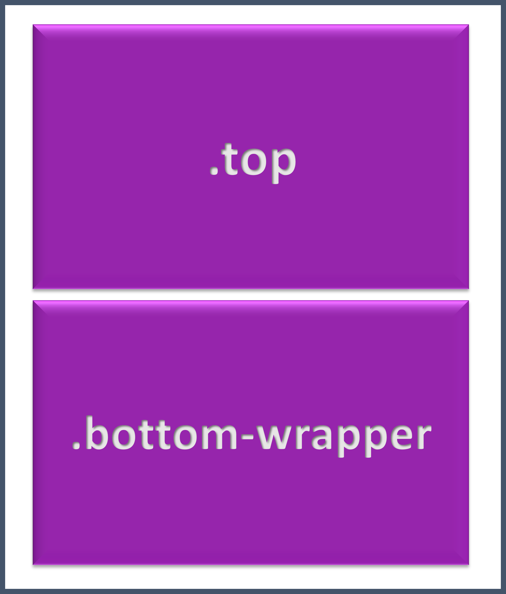
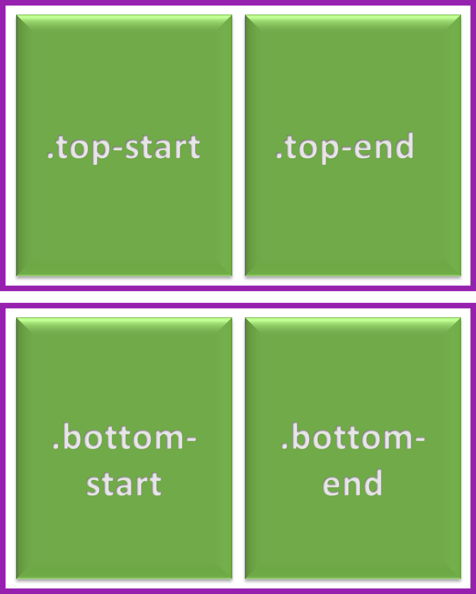
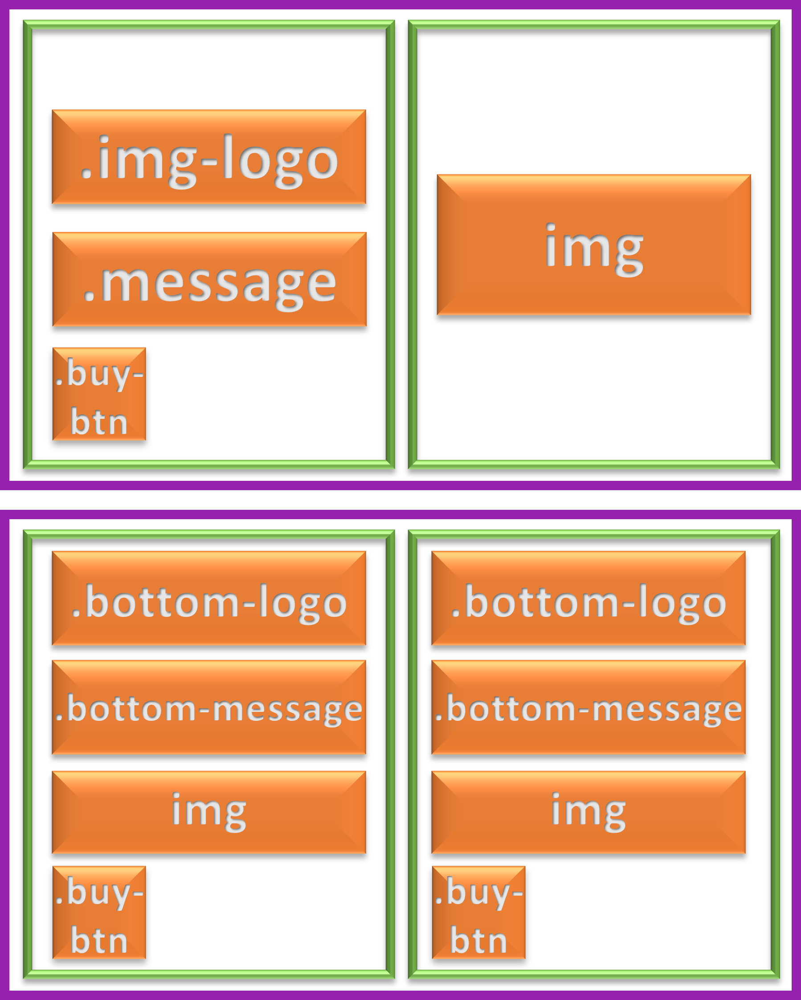

# HOME WORK - Mission-01

## 과제 소개

E-commerce 디자인 시안에 따라 마크업 설계 및 구현

## 과제 기간

- 2023-11-02 ~ 2023-11-03

## 개발자

- 정서린

## 개발 환경

- HTML
- CSS

## 상세 정보

**HTML 설계 배치**

1. 상단, 하단으로 구분
   

1. 상단을 로고 메세지 / 이미지로 구분
1. 하단을 브랜드로 구분
   
1. 상단의 좌를 로고 - 문구 - **버튼** 으로 배치
1. 하단을 로고 - 문구 - 제품사진 - 버튼으로 배치
   

**CSS**

- **중앙 정렬**  
  flex 이용한 좌우 상하 정렬

  ```
  body {
    height: 100vh;
    display: flex;
    flex-direction: column;
    justify-content: center;
    align-items: center;
  }
  ```

- **수평적 배치**  
  flex 이용한 수평적 배치

  ```
  .top {
    margin: auto;
    width: 502px;
    height: 310px;
    border: var(--normal-border);
    margin-bottom: 1rem;
    display: flex;
    flex-flow: row wrap;
    justify-content: center;
    align-items: center;
    position: relative;
  }
  ```

  float 이용한 수평적 배치

  ```
  .bottom-wrapper {
    margin: auto;
    width: 502px;
    display: flow-root;
  }

  .bottom {
    width: 243px;
    height: 310px;
    border: var(--normal-border);
    text-align: center;
    float: left;
    padding: 14px;
    font-size: 18px;
    color: #555;
    position: relative;
  }
  ```

- **버튼 배치**
  position:absolute를 이용한 위치 고정
  버튼 효과 - hover와 hover에 가상요소 사용

  ```
  .buy-btn {
    border: none;
    width: 42px;
    height: 42px;
    background: url(./images/button.svg) no-repeat;
    position: absolute;
    bottom: 20px;
    left: 20px;
  }

  .buy-btn:hover {
    width: 112px;
    height: 42px;
    background: var(--blue-600);
  }

  .buy-btn:hover::after {
    content: "구매하기 >";
    color: #fff;
    word-spacing: 15px;
  }
  ```
