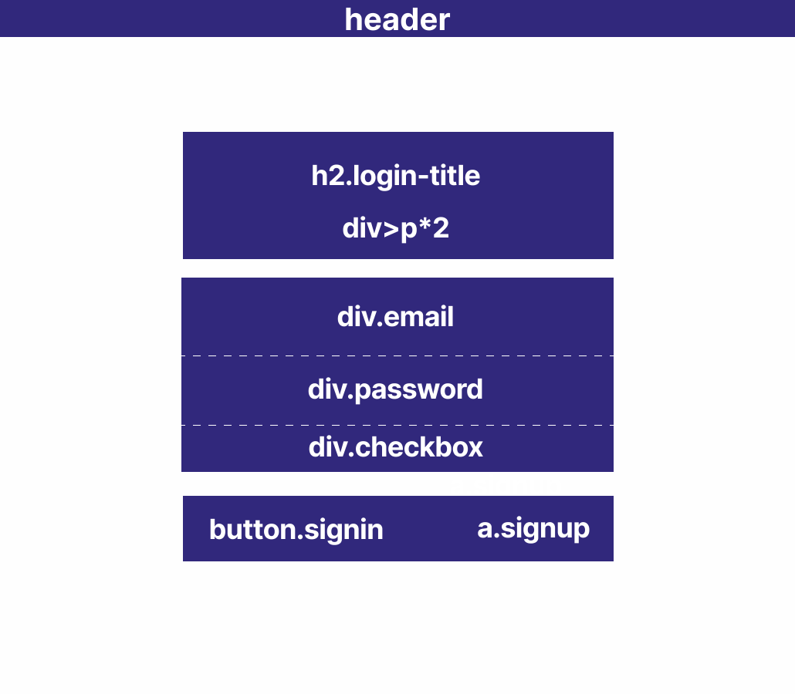

# HOME WORK - Mission-02

## 과제 소개

"Ediya Coffee"의 로그인 페이지 마크업 설계 및 구현

## 과제 기간

- 2023-11-09 ~ 2023-11-10

## 개발자

- 정서린

## 개발 환경

- HTML
- CSS
- JavaScript

## 상세 정보

**1. HTML 설계 배치**



- 마크업 구조는 세 부분으로 구역 나눔

  1.Welcome message - 환영 메세지 <br>

  2.Form - 이메일, 비밀번호, 이메일저장

  3.button & link - 로그인 버튼, 회원가입 페이지 링크

**2. CSS**

- **Form 배치**

  grid를 이용한 3단 셀 정렬

  ```
  .form {
    margin: 8.5vh auto 0 auto;
    width: 540px;
    display: grid;
    grid-template-rows: 70px 70px 30px;
  }
  ```

- **Input Label 애니메이션**

  transform을 이용한 위치 변환, transition으로 진행되는 시간 설정
  \*~(tilde) 기호 사용으로 input 다음에 오는 (형제인) label 요소에 css 디자인 가능

  ```
  .label-style {
    position: absolute;
    top: 0;
    left: 0;
    padding: 15px 8px;
    font-size: 1.125rem;
    transition: 0.5s;
  }

  .input-style:valid ~ .label-style,
  .input-style:focus ~ .label-style {
    font-size: 0.8125rem;
    transform: translateX(-8px) translateY(-15px);
  }
  ```

- **반응형 디자인**

  미디어 쿼리를 이용하여 view port의 최대 너비가 600px이 될 때의 스타일 작성

  ```
  @media (max-width: 600px) {
    .header {
      width: 100vh;
    }
    ...
  }
  ```

**3. JavaScript**

- **이메일 유효검사**

  valid/invalid: value 값의 변화에 따라 유효한 이메일 형태가 나오지 않으면 경고 메세지 나오게 설정.

- **비밀번호 보기/숨기기**

  비밀번호 보기/숨기기: checkbox의 클릭에 따라 type을 바꾸어 text가 보이게 또는 숨기게 설정.
