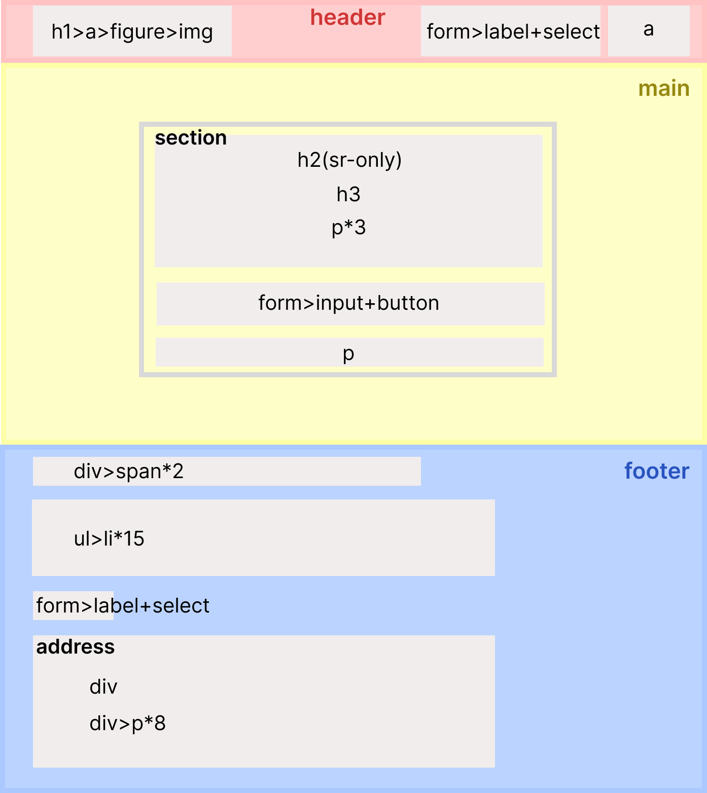
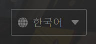
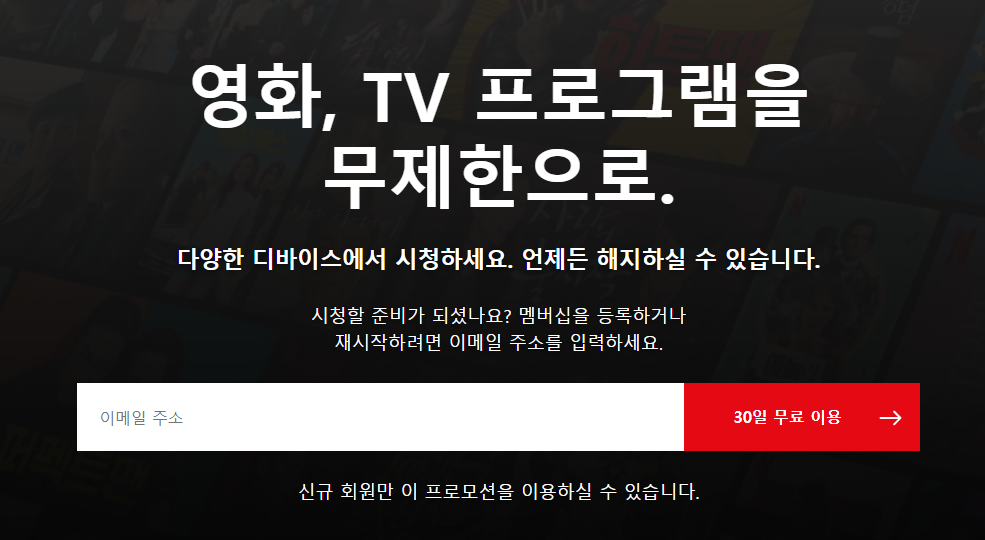
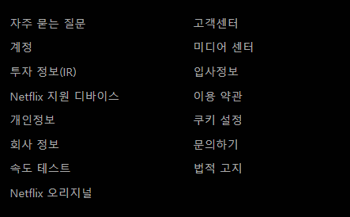
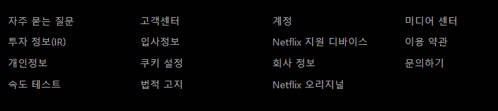
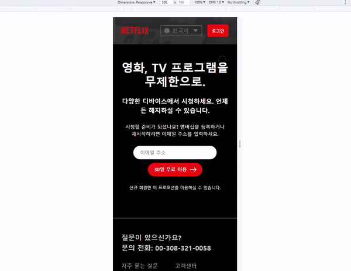

# HOME WORK - Mission-03

## 과제 소개

"Netflix"의 header, promotion, footer 마크업 설계 및 구현

## 과제 기간

- 2023-11-13 ~ 2023-11-17

## 개발자

- 정서린

## 개발 환경

- HTML
- CSS

## 상세 정보

**1. HTML 설계 배치**



구조

1. header

   - 로고와 언어선택/로그인 링크를 분리

2. main

   - section으로 프로모션 페이지 구분

3. footer

   - ul/li 요소에 링크를 address요소에 주소 정보

**2. CSS**



**2.1 언어 Select 디자인**

<details>
<summary>기존의 디자인을 없애고 배경에 두 이미지를 배치</summary>
<div markdown="1">

```css
.languages {
  appearance: none;
  padding: 5.5px 34px;
  color: #757575;
  background: url(./images/global.svg) no-repeat top 50% left 10px, url(./images/bi_caret-down-fill.svg)
      no-repeat top 50% right 10px, transparent;
  border: 1px solid #757575;
  border-radius: 2px;
  line-height: 1.2;
}
```

</div>

</details>

---



**2.2 Promotion - flex**

  <details>
  <summary>flex 세로 가운데 정렬</summary>
  <div markdown="1">

```css
.promotion {
  padding: 48px 0;
  margin: 0 auto;
  max-width: 1280px;
  display: flex;
  flex-flow: column nowrap;
  justify-content: center;
  align-items: center;
  row-gap: 1.5em;
}
```

  </div>

  </details>

---

 

**2.3 footer - grid**

  <details>
  <summary>모바일</summary>
  <div markdown="1">

```css
.footer-link {
  margin-top: 26px;
  display: grid;
  grid-template-columns: 1fr 1fr;
  grid-template-rows: auto;
  row-gap: 10px;
}
```

  </div>

  </details>
  <details>
  <summary>데스크탑</summary>
  <div markdown="1">

```css
@media (min-width: 768px) {
  .footer-link {
    margin-top: 50px;
    max-width: 1000px;
    grid-template-columns: repeat(4, 1fr);
  }
}
```

  </div>

  </details>

## 완성 모습


